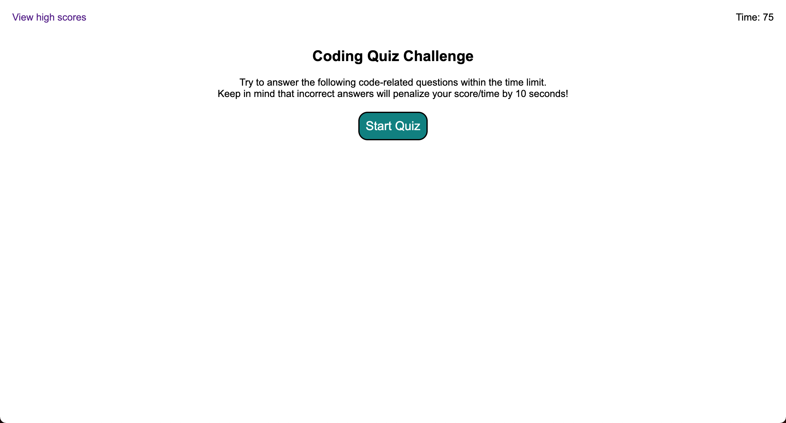

# Timed Coding Quiz
This application is a timed coding quiz with multiple-choice questions that features dynamically updated HTML and CSS powered by JavaScript.

## Usage
> [Link to deployed application](https://kyoriku.github.io/code-quiz/)

## Credits
- [MDN - HTMLElement: hidden property](https://developer.mozilla.org/en-US/docs/Web/API/HTMLElement/hidden)
- [How to add onclick event to start timer](https://stackoverflow.com/questions/54637148/how-to-add-onclick-event-to-start-timer)
- [MDN - Document: getElementById() method](https://developer.mozilla.org/en-US/docs/Web/API/Document/getElementById)
- [MDN - Element: setAttribute() method](https://developer.mozilla.org/en-US/docs/Web/API/Element/setAttribute)
- [MDN - Node: appendChild() method](https://developer.mozilla.org/en-US/docs/Web/API/Node/appendChild)
- [MDN - Node: removeChild() method](https://developer.mozilla.org/en-US/docs/Web/API/Node/removeChild)
- [MDN - Element: innerHTML property](https://developer.mozilla.org/en-US/docs/Web/API/Element/innerHTML)
- [MDN - HTMLElement: innerText property](https://developer.mozilla.org/en-US/docs/Web/API/HTMLElement/innerText)
- [MDN - Node: textContent property](https://developer.mozilla.org/en-US/docs/Web/API/Node/textContent)
- [MDN - setInterval() global function](https://developer.mozilla.org/en-US/docs/Web/API/setInterval)