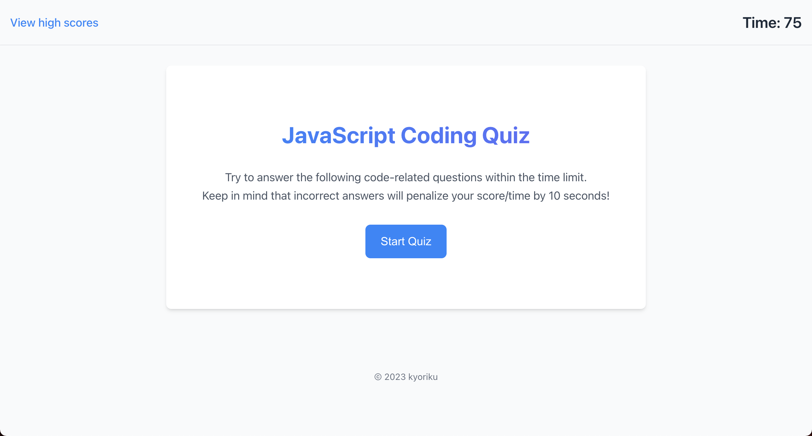
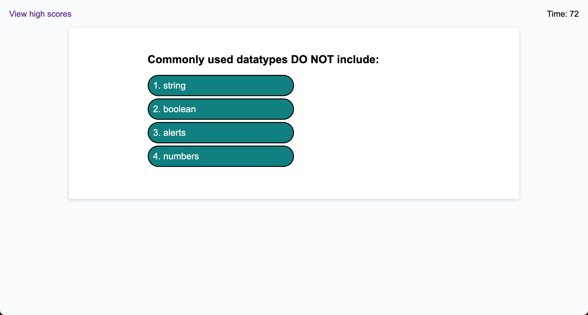
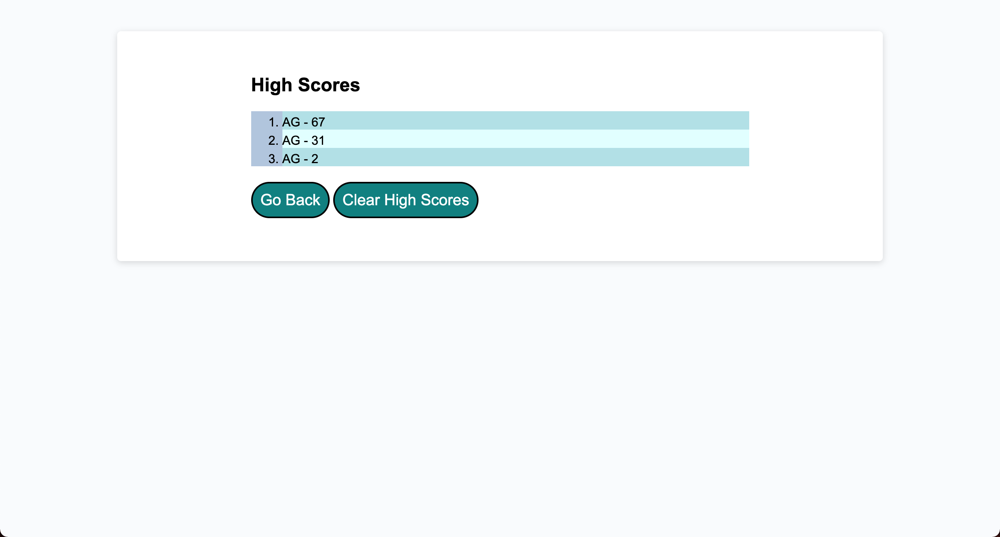

# JavaScript Coding Quiz
*An interactive JavaScript quiz application featuring timed coding assessments, score tracking, and dynamic feedback with time penalties for incorrect answers*

## Built With
[](https://developer.mozilla.org/en-US/docs/Web/HTML)
[](https://developer.mozilla.org/en-US/docs/Web/CSS)
[](https://developer.mozilla.org/en-US/docs/Web/JavaScript)

## Table of Contents
- [Description](#description)
  - [Deployed Site](#deployed-site)
- [Features](#features)
- [Screenshots](#screenshots)
- [Technical Details](#technical-details)
- [Installation](#installation)
- [Usage](#usage)
- [Contributing](#contributing)
- [Credits](#credits)
- [License](#license)
- [Questions](#questions)

## Description
This interactive coding quiz application demonstrates the power of dynamic web development, featuring a responsive interface that updates in real-time as users progress through multiple-choice questions. Built with vanilla JavaScript, HTML, and CSS, this project showcases fundamental web development concepts while providing an engaging learning experience for aspiring developers.

The application combines timing mechanics with score tracking, creating an engaging challenge that tests both knowledge and speed. When incorrect answers are chosen, the timer penalty adds an extra layer of strategy to the quiz-taking experience.

The quiz contains 10 questions covering fundamental JavaScript concepts including data types, operators, debugging tools, and basic syntax. Questions range from beginner-friendly topics like variable declaration and console logging to more intermediate concepts like event delegation and type coercion. This makes it an ideal learning tool for developers who are starting their JavaScript journey or looking to reinforce their foundational knowledge.

### Deployed Site
Visit the live application at: [kyoriku.github.io/javascript-coding-quiz](https://kyoriku.github.io/javascript-coding-quiz/)

## Features
* **Dynamic Content Updates**
  * Questions and answers update in real-time without page reloads
  * Immediate feedback on answer correctness
  * Smooth transitions between questions

* **Timer Functionality**
  * Countdown timer starts with quiz initiation
  * 10-second penalty for incorrect answers
  * Quiz auto-submits when timer reaches zero

* **Score Management**
  * Real-time score tracking
  * High score storage using localStorage
  * Leaderboard functionality for tracking top performances

* **User Interface**
  * Clean, intuitive design
  * Responsive layout
  * Clear feedback mechanisms

## Screenshots




## Technical Details
The quiz application leverages several key web technologies and APIs:

* **Timer Implementation**
  * Uses `setInterval` for precise 1-second countdown updates
  * Implements penalty system that deducts 10 seconds for incorrect answers
  * Automatically ends quiz when timer reaches zero
  * Properly cleans up timer using `clearInterval` to prevent memory leaks

* **DOM Manipulation**
  * Dynamic creation and removal of question elements
  * Real-time updates of timer and score displays
  * Event delegation for handling answer selections
  * Efficient cleanup of child elements using `removeChild`

* **State Management**
  * Manages quiz state without framework assistance
  * Tracks current question index, timer value, and score
  * Handles transitions between quiz phases (pre-game, questions, post-game)
  * Maintains separate view states for different game sections

* **Local Storage Integration**
  * Persistent storage of high scores using `localStorage`
  * JSON parsing and stringifying for data storage
  * Sorted leaderboard implementation
  * Score clearing functionality

* **Event Handling**
  * Click event listeners for quiz navigation
  * Answer selection validation
  * Score submission processing
  * View state management for high scores display

* **Error Prevention**
  * Guards against negative timer values
  * Handles missing local storage data
  * Prevents multiple timer instances
  * Manages proper cleanup of DOM elements

* **Code Organization**
  * Modular function design
  * Clear separation of concerns
  * Consistent variable naming conventions
  * Well-structured question data format

## Installation
To run this project locally:

1. Clone the repository
    ```bash
    git clone https://github.com/kyoriku/javascript-coding-quiz.git
    ```
2. Open the `index.html` file in your preferred web browser

## Usage
1. Click the "Start Quiz" button to begin
2. Answer each question within the time limit
3. Receive immediate feedback on your answers
4. Submit your initials at the end to save your score
5. View the high scores leaderboard

## Contributing
Contributions are welcome! Here are ways you can help:

1. Fork the repository
2. Create a feature branch
    ```bash
    git checkout -b feature/YourFeature
    ```
3. Make your changes - this could include:
    * Improving the UI/UX
    * Enhancing accessibility
    * Optimizing code performance
    * Adding new features
    * Bug fixes
4. Commit your changes
    ```bash
    git commit -m 'Add description of your changes'
    ```
5. Push to your branch
    ```bash
    git push origin feature/YourFeature
    ```
6. Open a Pull Request

Please ensure your contributions:
* Follow the existing code style
* Maintain the application's challenge level and timing balance
* Test all changes locally before submitting
* Include clear descriptions of changes in your pull request

## Credits
Built with knowledge from the following resources:

* **Mozilla Developer Network (MDN)**
  * [Document Methods and Properties](https://developer.mozilla.org/en-US/docs/Web/API/Document)
  * [Element Manipulation](https://developer.mozilla.org/en-US/docs/Web/API/Element)
  * [Local Storage](https://developer.mozilla.org/en-US/docs/Web/API/Window/localStorage)
  * [Timing Functions](https://developer.mozilla.org/en-US/docs/Web/API/setInterval)

* **Stack Overflow**
  * [Timer Implementation Guidance](https://stackoverflow.com/questions/54637148/how-to-add-onclick-event-to-start-timer)

## License
[](https://opensource.org/licenses/MIT)

This project is licensed under the [MIT](https://opensource.org/licenses/MIT) license - see the LICENSE file for details.

## Questions
For any questions, feel free to email me at devkyoriku@gmail.com.