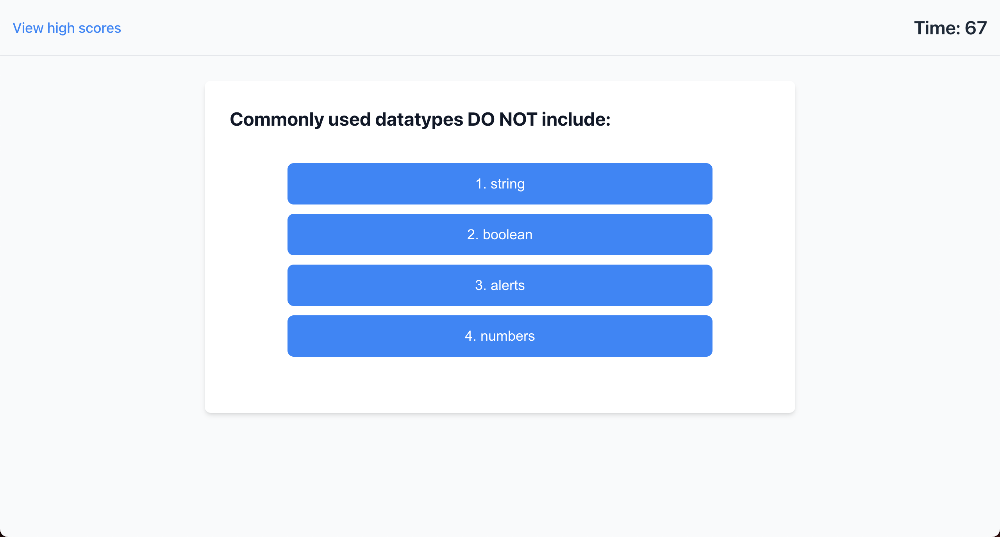
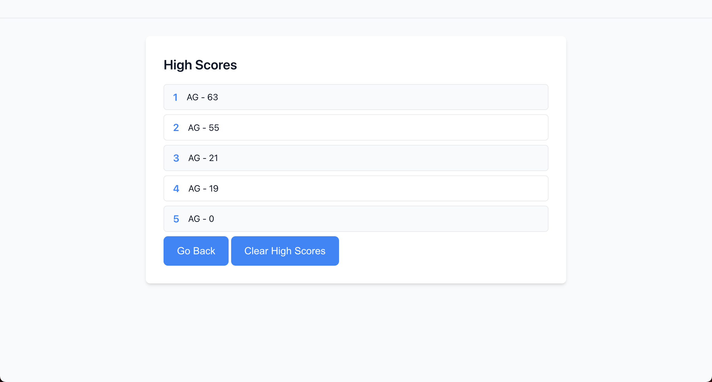

# JavaScript Coding Quiz
*An interactive JavaScript quiz application featuring timed coding assessments, score tracking, and dynamic feedback with time penalties for incorrect answers*

## Built With
[](https://developer.mozilla.org/en-US/docs/Web/HTML)
[](https://developer.mozilla.org/en-US/docs/Web/CSS)
[](https://developer.mozilla.org/en-US/docs/Web/JavaScript)

## Table of Contents
- [Description](#description)
  - [Deployed Site](#deployed-site)
- [Features](#features)
- [Screenshots](#screenshots)
- [Technical Details](#technical-details)
- [Installation](#installation)
- [Usage](#usage)
- [Contributing](#contributing)
- [Credits](#credits)
- [License](#license)
- [Questions](#questions)

## Description
This interactive coding quiz application demonstrates the power of dynamic web development, featuring a responsive interface that updates in real-time as users progress through multiple-choice questions. Built with vanilla JavaScript, HTML, and CSS, this project showcases fundamental web development concepts while providing an engaging learning experience for aspiring developers.

The application combines timing mechanics with score tracking, creating an engaging challenge that tests both knowledge and speed. When incorrect answers are chosen, the timer penalty adds an extra layer of strategy to the quiz-taking experience.

The quiz contains 10 questions covering fundamental JavaScript concepts including data types, operators, debugging tools, and basic syntax. Questions range from beginner-friendly topics like variable declaration and console logging to more intermediate concepts like event delegation and type coercion. This makes it an ideal learning tool for developers who are starting their JavaScript journey or looking to reinforce their foundational knowledge.

### Deployed Site
Visit the live application at: [https://kyoriku.github.io/javascript-coding-quiz/](https://kyoriku.github.io/javascript-coding-quiz/)

## Features
* **Dynamic Content Updates**
  * Questions and answers update in real-time without page reloads
  * Immediate feedback on answer correctness
  * Smooth transitions between questions

* **Timer Functionality**
  * Countdown timer starts with quiz initiation
  * 10-second penalty for incorrect answers
  * Quiz auto-submits when timer reaches zero

* **Score Management**
  * Real-time score tracking
  * High score storage using localStorage
  * Leaderboard functionality for tracking top performances

* **User Interface**
  * Clean, intuitive design
  * Responsive layout
  * Clear feedback mechanisms

## Screenshots




## Technical Details
This coding quiz was built using the following technologies and features:

* **JavaScript Timer System**: Implements a sophisticated countdown system for quiz management:
   * `setInterval`: Creates a precise 1-second countdown timer
   * `clearInterval`: Properly cleans up timer instances to prevent memory leaks
   * Penalty system: Deducts 10 seconds for incorrect answers
   * Auto-submission: Ends quiz when timer reaches zero

* **DOM Manipulation**: Extensive use of DOM methods for dynamic content updates:
   * `createElement`: Generates new elements for questions and answer choices
   * `removeChild`: Efficiently cleans up DOM elements between questions
   * `setAttribute`: Sets classes and attributes for styling and functionality
   * `innerHTML/textContent`: Updates content for questions, timer, and scores

* **Local Storage Integration**: Manages persistent data storage for high scores:
   * `localStorage.setItem`: Stores high scores and user initials
   * `localStorage.getItem`: Retrieves stored score data
   * `JSON.parse/stringify`: Handles data conversion for storage
   * Score sorting: Implements leaderboard ordering functionality

* **Event Handling System**: Manages all user interactions:
   * Click events: Controls quiz navigation and answer selection
   * Submit events: Handles score submission and user initials
   * View state events: Manages transitions between quiz phases
   * Back/Clear buttons: Controls quiz reset and score management

* **State Management**: Tracks various aspects of quiz progress:
   * Question tracking: Manages current question index and available questions
   * Score calculation: Computes final score based on remaining time
   * View states: Handles transitions between pre-game, questions, and post-game
   * Error states: Manages timer and score edge cases

* **CSS Implementation**: Styles the application for optimal user experience:
   * Responsive design: Ensures compatibility across devices
   * Dynamic classes: Changes styles based on quiz state
   * Transition effects: Provides visual feedback for interactions
   * Consistent styling: Maintains unified look throughout application

## Installation
To run this project locally:

1. Clone the repository
    ```bash
    git clone https://github.com/kyoriku/javascript-coding-quiz.git
    ```
2. Open the `index.html` file in your preferred web browser

## Usage
1. Click the "Start Quiz" button to begin
2. Answer each question within the time limit
3. Receive immediate feedback on your answers
4. Submit your initials at the end to save your score
5. View the high scores leaderboard

## Contributing
Contributions are welcome! Here are ways you can help:

1. Fork the repository
2. Create a feature branch
    ```bash
    git checkout -b feature/YourFeature
    ```
3. Make your changes - this could include:
    * Improving the UI/UX
    * Enhancing accessibility
    * Optimizing code performance
    * Adding new features
    * Bug fixes
4. Commit your changes
    ```bash
    git commit -m 'Add description of your changes'
    ```
5. Push to your branch
    ```bash
    git push origin feature/YourFeature
    ```
6. Open a Pull Request

Please ensure your contributions:
* Follow the existing code style
* Maintain the application's challenge level and timing balance
* Test all changes locally before submitting
* Include clear descriptions of changes in your pull request

## Credits
Built with knowledge from the following resources:

* **Mozilla Developer Network (MDN)**
  * [Document Methods and Properties](https://developer.mozilla.org/en-US/docs/Web/API/Document)
  * [Element Manipulation](https://developer.mozilla.org/en-US/docs/Web/API/Element)
  * [Local Storage](https://developer.mozilla.org/en-US/docs/Web/API/Window/localStorage)
  * [Timing Functions](https://developer.mozilla.org/en-US/docs/Web/API/setInterval)

* **Stack Overflow**
  * [Timer Implementation Guidance](https://stackoverflow.com/questions/54637148/how-to-add-onclick-event-to-start-timer)

## License
[](https://opensource.org/licenses/MIT)

This project is licensed under the [MIT](https://opensource.org/licenses/MIT) license - see the LICENSE file for details.

## Questions
For any questions, feel free to email me at devkyoriku@gmail.com.